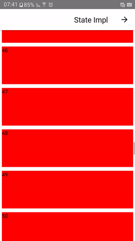

# react-native-visibility-tracker

## WIP
**NOTICE** currently only android is supported so if in a rush [react-native-inviewport](https://github.com/yamill/react-native-inviewport).

Why not `react-native-inviewport`? It's `js` based. This library is native and can be used with `react-native-reanimated` or react-native's own `Animated` API.

PRs are welcome.





## Getting started

`$ npm install react-native-visibility-tracker --save` **OR** `$ yarn add react-native-visibility-tracker`

## Usage
```ts
import VisibilityTracker from 'react-native-visibility-tracker';

function VisiblityTrackerItem(props: { index: number }) {
    const [isVisible, setVisible] = useState(false);
    return (
        <VisibilityTracker
            onVisibilityChanged={e => setVisible(e.nativeEvent.visible)}
        >
            <View
                collapsable={false}
                style={[{
                    backgroundColor: isVisible ? 'blue' : 'red',
                    height: 100,
                    margin: 5
                }]}
            >
                <Text>{props.index}</Text>
            </View>
        </VisibilityTracker>
    )
}

```
